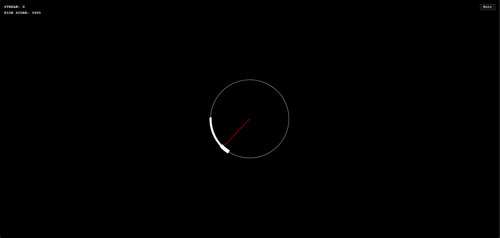

# DBD Skill Check Game

A fast-paced, DBD-inspired skill check rhythm game built with vanilla HTML, CSS, and JavaScript. Test your reflexes by clicking at the perfect moment when the pointer aligns with the target zone!



## 🎮 How to Play

1. **Press `SPACE`** to start a new game
2. Wait for the **pointer** (red line) to rotate and enter the **white arc**
3. Click `SPACE` when the pointer is inside the target zone:
   - **Success Zone** (thicker arc): Great hit! +250 points
   - **Good Zone** (standard arc): Good hit! +100 points
4. Build your combo streak for multipliers (up to 5x)
5. A miss ends the game immediately

### Controls
| Key | Action |
|-----|--------|
| `SPACE` | Start/Restart game or perform a skill check |
| Click | Mute/Unmute audio |

## 🎯 Game Mechanics

- **Combo System**: Each successful hit increases your combo multiplier
- **Speed Scaling**: Great hits accelerate the rotation speed over time
- **High Score**: Your best score is saved locally in your browser
- **Arc Zones**: Two distinct zones for different point values and bonus effects

## 📁 Project Structure

```
gen-rush/
├── index.html          # Main game page
├── game.js             # Game logic and rendering
├── style.css           # Styling and animations
├── assets/
│   └── sounds/         # Audio files for skill check feedback
│       ├── dbd-check-start.mp3      # Check start sound
│       ├── dbd-good-skill-check.mp3 # Good hit sound
│       └── dbd-great-skill-check.mp3 # Great hit sound
└── README.md           # This file
```

## 🛠️ Tech Stack

- **HTML5 Canvas** - 2D rendering and game loop
- **Vanilla JavaScript (ES6+)** - No frameworks or dependencies
- **CSS3** - Styles and animations
- **Web Audio API** - Sound effects and audio management
- **LocalStorage** - High score persistence

## 🚀 Getting Started

Simply open `index.html` in a modern web browser. No build step required!

### Development Setup (Optional)

For local development with hot reloading:

```bash
# Install a simple HTTP server
npm install -g serve

# Serve the project
npx serve . --port 3000
```

Then open `http://localhost:3000` in your browser.

## 🎵 Audio

The game uses Web Audio API for sound effects:

- **Check Start**: Plays when a new skill check begins
- **Good Hit**: Plays on successful hits in the standard zone
- **Great Hit**: Plays on perfect timing in the bonus zone
- **Miss**: Synthesized audio (no file needed) - plays automatically on misses

The mute button toggles all audio.

## ⚙️ Configuration

Tune game behavior by editing `CONFIG` object in `game.js`:

```javascript
const CONFIG = {
    rotationPeriod: 1200,        // ms for full rotation (~1.2s)
    speedupRate: 0.05,           // 5% faster every speedup interval
    successArcWidth: 60,         // degrees - the "good" zone
    greatZoneWidth: 15,          // degrees - leading edge (bonus zone)
    checkGap: 400,               // ms between checks
    checkGapGreat: 900,          // ms pause after a great hit
    scoreGood: 100,
    scoreGreat: 250,
    maxMultiplier: 5,
};
```

## 📊 Game States

- **Idle**: Initial state - press SPACE to start
- **Active**: Pointer is rotating, waiting for input
- **Frozen**: After a great hit, pointer freezes at current position
- **GameOver**: Game ended on miss - press SPACE to restart

## 📄 License

This project is open source. Feel free to use, modify, and distribute.

## 🎨 Design Inspiration

The game is inspired by DBD's (Dead by Daylight) skill checks.

## 📝 Credits

Built with pure vanilla JavaScript for maximum compatibility and minimal dependencies.
