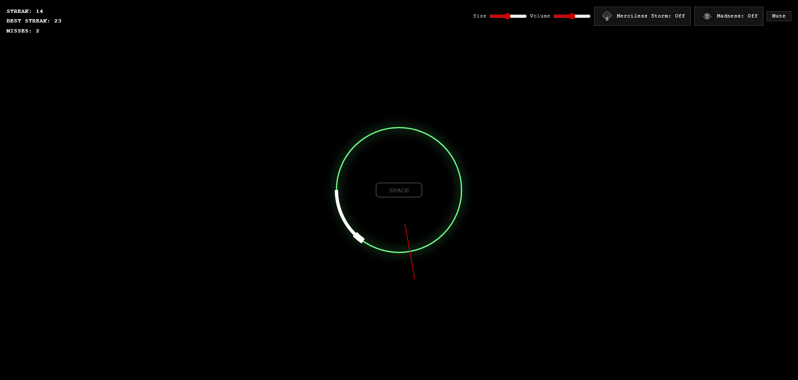

# DBD Skill Check Game

A fast-paced, DBD-inspired skill check rhythm game built with vanilla HTML, CSS, and JavaScript. Test your reflexes by clicking at the perfect moment when the pointer aligns with the target zone!



## 🎮 How to Play

1. **Press `SPACE`** to start a new game
2. Wait for the **pointer** (red line) to rotate and enter the **white arc**
3. Click `SPACE` when the pointer is inside the target zone:
   - **Success Zone** (thicker arc): Great hit! +250 points
   - **Good Zone** (standard arc): Good hit! +100 points
4. Build your combo streak for multipliers (up to 5x)
5. A miss resets your streak and is counted, but the game keeps going. If you miss 5 times in a row (you've probably walked away), the game pauses until you press `SPACE`

### Controls
| Key | Action |
|-----|--------|
| `SPACE` | Start the game, perform a skill check, or resume when paused |
| `Size` slider | Make the circle smaller or bigger (remembered in your browser) |
| `Volume` slider | Set the sound volume (remembered in your browser) |
| Click `Merciless Storm` | Toggle Merciless Storm mode (off by default) |
| Click `Madness` | Toggle Madness mode (off by default) |
| Click `Mute` | Mute/Unmute audio |

### Modes (top-right toggles, remembered in your browser)

Both are off by default and can be combined.

- **Merciless Storm** (killer perk): the arc can appear anywhere, even right under the pointer, as a smaller hollow curved bar. Any hit inside it counts as a good hit.
- **Madness** (Doctor): the skill check jumps to a new spot on the screen every check.

## 🎯 Game Mechanics

- **Combo System**: Each successful hit increases your combo multiplier
- **Speed Scaling**: Great hits accelerate the rotation speed over time
- **Best Streak**: Your longest run of hits is saved locally in your browser
- **Ring Feedback**: After each check the ring turns red (miss), green (good) or glowing green (great) for about a second, then fades back
- **Miss Counter**: Misses are tallied in the top-left; there is no game over
- **Arc Zones**: Two distinct zones for different point values and bonus effects

## 📁 Project Structure

```
gen-rush/
├── index.html          # Main game page
├── game.js             # Game logic and rendering
├── style.css           # Styling and animations
├── assets/
│   ├── icons/          # Merciless Storm and Madness toggle icons
│   └── sounds/         # Audio files for skill check feedback
│       ├── dbd-check-start.mp3      # Check start sound
│       ├── dbd-good-skill-check.mp3 # Good hit sound
│       └── dbd-great-skill-check.mp3 # Great hit sound
└── README.md           # This file
```

## 🛠️ Tech Stack

- **HTML5 Canvas** - 2D rendering and game loop
- **Vanilla JavaScript (ES6+)** - No frameworks or dependencies
- **CSS3** - Styles and animations
- **Web Audio API** - Sound effects and audio management
- **LocalStorage** - Best streak and settings persistence

## 🚀 Getting Started

Simply open `index.html` in a modern web browser. No build step required!

### Development Setup (Optional)

For local development with hot reloading:

```bash
# Install a simple HTTP server
npm install -g serve

# Serve the project
npx serve . --port 3000
```

Then open `http://localhost:3000` in your browser.

## 🎵 Audio

The game uses Web Audio API for sound effects:

- **Check Start**: Plays when a new skill check begins
- **Good Hit**: Plays on successful hits in the standard zone
- **Great Hit**: Plays on perfect timing in the bonus zone
- **Miss**: Synthesized audio (no file needed) - plays automatically on misses

The mute button toggles all audio.

## ⚙️ Configuration

Tune game behavior by editing `CONFIG` object in `game.js`:

```javascript
const CONFIG = {
    rotationPeriod: 1200,        // ms for full rotation (~1.2s)
    speedupRate: 0.05,           // 5% faster every speedup interval
    successArcWidth: 55,         // degrees - the "good" zone
    greatZoneWidth: 10,          // degrees - leading edge (bonus zone)
    arcMinLead: 120,             // degrees - earliest arc start, clockwise from 12 o'clock
    arcEndMargin: 20,            // degrees - arc must end this far before returning to 12 o'clock
    stormZoneWidth: 35,          // degrees - Merciless Storm's smaller hollow zone
    missPauseLimit: 5,           // consecutive misses before the game pauses (player is AFK)
    defaultRadius: 150,          // px - ring radius until the size slider is moved
    minRadius: 60,               // px - smallest ring the size slider allows
    maxRadius: 250,              // px - largest ring the size slider allows
    defaultVolume: 50,           // % - volume until the volume slider is moved (100% = full master gain)
    soundPeakDb: -15,            // dBFS - every sound effect is peak-normalized to this level
    madnessOffsetX: 3,           // Madness: max horizontal jump from screen center, in ring radii
    madnessOffsetY: 1.5,         // Madness: max vertical jump from screen center, in ring radii
    hintPlayingOpacity: 0.25,    // SPACE key hint opacity while a game is being played
    ringFlashDuration: 1000,     // ms the ring stays tinted after a hit or miss, fading out at the end
    ringFlashFade: 300,          // ms of that duration spent fading back to the normal ring
    scoreGood: 100,
    scoreGreat: 250,
    maxMultiplier: 5,
};
```

## 📊 Game States

- **Idle**: Initial state - the `SPACE` key hint is shown at full opacity; press SPACE to start
- **Active**: Pointer starts at 12 o'clock and rotates clockwise; a hit starts the next check immediately, and a pointer that passes the arc without input is a miss. The `SPACE` hint fades while you play
- **Paused**: 5 misses in a row pause the game (press SPACE to resume)

## 📄 License

This project is open source. Feel free to use, modify, and distribute.

## 🎨 Design Inspiration

The game is inspired by DBD's (Dead by Daylight) skill checks.

## 📝 Credits

Built with pure vanilla JavaScript for maximum compatibility and minimal dependencies.
