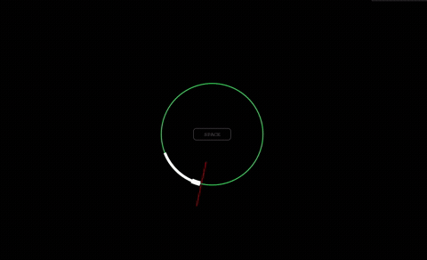

# DBD Skill Check Game

A Dead by Daylight-style skill check game built with vanilla HTML, CSS, and JavaScript. Hit `SPACE` when the pointer is inside the target zone.



## How to Play

1. Press `SPACE` to start.
2. The red pointer starts at 12 o'clock and rotates clockwise. Press `SPACE` when it is inside the white arc.
   - Great zone (the thick notch at the leading edge): +250 points
   - Good zone (the rest of the arc): +100 points
3. Consecutive hits build a streak and a score multiplier (up to 5x), and every 5 great hits the pointer speeds up.
4. A miss resets your streak, but the game keeps going. After 5 misses in a row the game pauses until you press `SPACE`. The sliders and toggles still work while paused, so you can adjust settings without racing the next check.

The ring flashes red, green, or glowing green after each check to show a miss, good, or great. Hits also throw green sparks off the ring: a big burst for a great, a small puff for a good. A miss gets a few small red sparks.

## Controls

| Control | Action |
|---------|--------|
| `SPACE` | Start, skill check, or resume when paused |
| Size slider | Make the circle smaller or bigger |
| Volume slider / Mute | Adjust or silence the sound |
| Merciless Storm | Toggle the killer perk mode |
| Madness | Toggle the Doctor mode |
| Effects | Turn the ring tint and sparks off or on (on by default) |

Slider and toggle settings are remembered in your browser, as is your best streak.

## Modes

Both are off by default and can be combined.

- **Merciless Storm**: the arc can appear anywhere, even under the pointer, as a smaller hollow bar. Any hit counts as a good hit.
- **Madness**: the skill check jumps to a new spot on the screen every time.

## Running It

No build step. Open `index.html` in a browser, or serve the folder:

```bash
npx serve .
```

## Tuning

Game feel is controlled by the `CONFIG` object at the top of `game.js`: rotation speed, arc widths, miss pause limit, ring size limits, default volume, and so on.

## Credits

Inspired by Dead by Daylight's skill checks. Open source: use, modify, and distribute freely.
